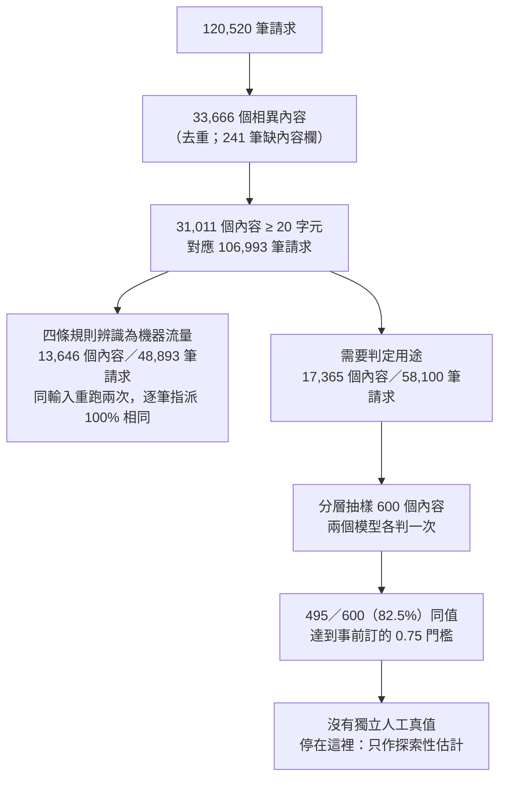

# CGU AI Gateway 使用分析

<https://github.com/RAYYO2059/cgu-gateway-usage>

長庚大學的 AI Gateway 讓全校師生透過同一個入口呼叫 OpenAI 等模型。校方想知道三件事：**誰在用、花了多少、拿來做什麼**。日誌裡沒有這三個問題的現成答案：身分被雜湊、沒有金額欄位、也沒有用途欄位。所以這個專案做的是**重建**，不是查詢。

這份文件先講結論。每個結論都附上它能信到什麼程度，以及不能延伸到哪裡。這個專案的主要工作不在算出數字，而在交代每個數字的可信範圍。

## 範圍

主要資料是 lite 匯出：台北時間 2026-07-30 至 08-24，24 個有資料的曆日。08-08、08-09 沒有任何請求，已查證是服務中斷，不是資料缺漏。

<!-- AUTOGEN:HIGHLIGHTS_LITE:START -->
- **規模與成本**（lite，24 天／120,520 筆／357 個 uid，其中 275 人、82 個服務憑證）。牌價等值成本合計 **US$2,749.32**，其中快取讀寫合計佔 **47.2%**——機制的解釋見 [docs/RESULTS.md](docs/RESULTS.md)。
<!-- AUTOGEN:HIGHLIGHTS_LITE:END -->

這 120,520 筆是**上游過濾之後**交付的記錄。上游在匯出時另外排除了 21,099 筆（佔來源記錄的 14.90%），而且被排除記錄的用量完全未知。所以下面所有規模與成本數字都不是 gateway 的全量，詳見 [UPSTREAM_FILTER.md](docs/UPSTREAM_FILTER.md)。

| 問題 | 狀態 | 一句話 |
| --- | --- | --- |
| 誰在用 | 可回答，粒度到學院 | 一半請求來自程式帳號；學院層級的數字常常主要在描述同系同屆的一群人 |
| 花多少 | 可回答，但是下界估計 | 牌價等值 US$2,749.32，近一半是重送對話歷史造成的快取成本 |
| 做什麼 | **無法給出用途分布** | 約四成五的請求能確定是機器流量；其餘沒有經人工驗證的分類 |

---

## 一、誰在用

**結論**：120,520 筆請求裡，將近一半（49.85%）來自服務憑證，也就是程式帳號，不是人。能歸屬到自然人的 60,445 筆中，教職員佔 37.26%，四個學院的學生佔 62.74%。但學院層級的數字要小心讀：在管理學院與智慧運算學院，**一群同系、同學位、同入學年的人**就發出了該院六到八成的請求。

| 學院 | 識別碼 | 請求數 | 遮罩後的組數 | 最大一組的人數 | 最大一組佔該院請求 |
| --- | ---: | ---: | ---: | ---: | ---: |
| 工學院 | 65 | 13,814 | 35 | 17 | 30.9% |
| 管理學院 | 33 | 12,086 | 12 | 17 | 78.7% |
| 智慧運算學院 | 24 | 8,073 | 6 | 12 | 61.1% |
| 醫學院 | 33 | 3,948 | 31 | 1 | 16.8% |

來源：[requests_by_unit_lite.csv](docs/data_lite/requests_by_unit_lite.csv)（`n_users`、`n_requests`、`n_accounts`、`n_users_in_top_account`、`top1_account_share`）。

**為什麼會這樣。** 帳號遮罩一律把末三碼換成 `XXX`。對學生帳號來說，那三碼是班級序號，所以同系、同學位、同入學年的人會被併成同一組。醫學院與管理學院都是 33 個識別碼，但醫學院分散在 31 組、最大一組只有 1 人，它的數字是 33 個人的加總；管理學院只落在 12 組，最大一組有 17 人，發出該院 78.7% 的請求。那一列的「學院」數字，主要在描述一個班。

這種集中**不觸發抑制**。抑制擋的是認出個人的風險，判準是母數至少 10 人、單人佔比不超過 30%，四個學院都通過。但它讓學院數字無法代表整個學院，所以必須標註。

**界線。**

- 275 個自然人識別碼是**人數上界**：遮罩碰撞只會讓實際人數更少。最小可靠粒度是學院，不能往下推到系所或個人。
- 教職員帳號是固定前綴加流水號，**不帶單位資訊**，所以教職員只能當成一個整體。
- 智慧運算學院只有人工智慧學系一個系，那一列實際上是系所層級，與其他三個學院不是同一種粒度。

完整論證：[OVERVIEW.md 第一、二節](docs/OVERVIEW.md#一資料範圍與涵蓋率)。

---

## 二、花多少

**結論**：以 2026-08-27 查得的公開牌價回推，這 24 天的等值成本是 **US$2,749.32**。它不是帳單，而且是**下界**。成本有兩個結構性特徵：

1. **將近一半是快取成本。** 未快取輸入 30.73%、快取讀取 28.46%、快取寫入 18.76%、輸出 22.05%，快取讀寫合計 47.22%。
2. **流量和成本不同步。** 教職員發出 18.69% 的請求，卻佔 38.37% 的成本；服務憑證的請求數最多，每筆成本卻最低。

| 單位 | 識別碼 | 請求數 | 成本（美元） | 每筆成本（美元） |
| --- | ---: | ---: | ---: | ---: |
| 教職員 | 120 | 22,524 | 1,054.95 | 0.047 |
| 服務憑證 | 82 | 60,075 | 495.67 | 0.008 |
| 工學院 | 65 | 13,814 | 445.11 | 0.032 |
| 管理學院 | 33 | 12,086 | 354.94 | 0.029 |
| 智慧運算學院 | 24 | 8,073 | 264.46 | 0.033 |
| 醫學院 | 33 | 3,948 | 134.18 | 0.034 |

來源：[cost_by_unit_lite.csv](docs/data_lite/cost_by_unit_lite.csv)、[cost_structure_lite.csv](docs/data_lite/cost_structure_lite.csv)。各列金額分別四捨五入，加總會與總額差一分。

**為什麼快取佔這麼多。** 這要用另一批資料解釋。lite 沒有對話結構，但 clean（7 月的 1.8 天）有。AI 編碼客戶端在一次使用者操作裡會連發多個請求，每次都重送完整的對話歷史。clean 量到：同一次操作裡，第 1 個請求的中位快取率是 0，第 2 個就跳到 95.9%。也就是說，大部分送出的內容是模型已經處理過的舊內容。成本近半不是花在產生新內容，而是花在重送；同樣的工作若用較少次請求完成，這部分成本會明顯下降。

**為什麼每筆成本差這麼多。** 教職員每筆約 $0.047，服務憑證約 $0.008，差將近 6 倍。原因分兩層：

- 服務憑證大量使用校內自建的本地模型。這類請求計入筆數，但不產生外部費用，所以把每筆平均壓低了。
- 在有計價的請求裡，教職員更常使用單價高的模型。

兩者性質不同：前者是基礎設施配置，後者是模型選擇。拆解數字見 [OVERVIEW.md 3.3](docs/OVERVIEW.md#33-請求數與成本分布)。

**界線。**

- **不是帳單。** 日誌沒有服務級距欄位（Batch／Flex 是半價），也無法得知機構折扣或區域加價。
- **是下界。** 上游排除的 21,099 筆沒有用量資料；按張或按秒計價的端點（語音、生圖，558 筆）也算不出金額。
- **價格本身有不確定性。** 78.43% 的金額來自官方明列價格；13.55% 建立在單一推估價上（gpt-5.6-sol 降價前的快取寫入價）；7.05% 是有時效的促銷價，同一批資料日後重算可能得到不同金額。

完整論證：[OVERVIEW.md 第三節](docs/OVERVIEW.md#三成本)。

---

## 三、做什麼

**結論**：**目前給不出「校內拿 AI 做什麼」的用途分布**，這是刻意停下來的結果，不是還沒做完。能確定的只有一件事：長度達 20 字元的內容所對應的請求中，有 45.7% 能被四條可重現的規則辨識為機器流量（工具自動發出、自動化流程中繼、向量化、生圖）。其餘內容做了兩個模型的交叉判定，但沒有人工驗證，所以只作為探索性估計，不當成結論。



**為什麼停在這裡。** 有三個理由，而且都不是增加樣本就能解決的：

1. **兩個模型一致，不等於判對了。** 82.5% 是兩個模型彼此的一致率，不是正確率。在更早的分流層，兩個模型只有 31/58（53.4%）同值，而且可用的中繼資料在結構上就分不開共識與非共識的群，換門檻也救不回來。那一層已經結案，不當用途來源。
2. **能分類的只是使用者輸入的那一段。** 日誌只保留使用者輸入的文字，不含系統指示與對話歷史。在需要判定的 58,100 筆請求中，至少 71.93% 實際送出的 token 數超過可見文字字元數的 4 倍，任何分詞器都解釋不了這個差距。我們看得到的內容，只是請求的一小部分。
3. **有未釐清的異常。** 母體已經排除規則能辨識的流量，照理不應再有「不需判定」的內容，但模型判出了 13 筆。這是規則漏抓還是模型判讀邊界，目前無法裁定。

**界線。** 探索性的模型標籤估計（含 95% 區間）只放在 OVERVIEW 第四節，並附完整限制。**本頁刻意不列任何用途百分比**，避免被當成答案引用。

完整論證：[OVERVIEW.md 第四節](docs/OVERVIEW.md#四用途分類的可回答界線)、[CLASSIFICATION_LIMITS.md](docs/CLASSIFICATION_LIMITS.md)、[DOMAIN_CROSS_RESULTS.md](docs/DOMAIN_CROSS_RESULTS.md)。

---

## 這批資料不能說什麼

1. **不能當成 gateway 的全量，也不能當成帳單。** 上游排除了 21,099 筆，成本是牌價回推的下界。見 [UPSTREAM_FILTER.md](docs/UPSTREAM_FILTER.md)。
2. **不能回推到個人，275 也不是精確人數。** 遮罩是多對一：不同遮罩帳號確定是不同人，同一遮罩帳號卻無法確定是同一人。見 [OVERVIEW.md 6.1](docs/OVERVIEW.md#61-粒度)。
3. **不能談作息、尖峰或學期間的使用量。** 24 天全在暑假，而且首日、末日與中斷後第一天都不完整。
4. **不能說用途比例。** 理由見上一節。
5. **clean 與 lite 不能合併或相加。** 兩批的識別碼分屬兩套無關的命名系統，期間也不連續。它們回答的是不同問題：lite 回答誰用、花多少，clean 回答一次操作內部發生了什麼。

## 資料內容的治理觀察

日誌內容中出現非 gateway 使用者本人的第三人資料，類別包括臨床照護紀錄、人事討論、同儕通訊內容與可定位的住戶資訊；另有校內服務的存取權杖隨客戶端自動附加的狀態進入日誌。這些當事人沒有提供同意，也無從提供。本專案對內容只保存字元長度與雜湊值，明文不寫入任何衍生資料，也不進版控。這裡只陳述類別，不描述內容與使用形態。

---

## 另一批資料：clean（1.8 天，看得到對話內部）

<!-- AUTOGEN:DATA:START -->
- **請求筆數**：9,937 列 × 89 欄
- **時間範圍**：2026-07-21 13:20:13 ~ 2026-07-23 07:56:46（Asia/Taipei）
- **分區**：3 天
- **四層母數**：
  - request：9,937
  - turn：1,025
  - thread：435
  - user：98
- **pipeline_version**：0.5.0

母數逐層下降是預期的：agent 會把一次使用者動作展開成多個請求，用 request 當分母會嚴重高估使用量。
<!-- AUTOGEN:DATA:END -->

clean 只有 1.8 天，不能拿來講規模或趨勢。但它是唯一帶有對話結構（`turn_id`）的資料，所以是唯一能量測**機制**的資料；而機制不依賴樣本量。上面「為什麼快取佔這麼多」的解釋就來自這裡。

<!-- AUTOGEN:HIGHLIGHTS:START -->
- **快取的位置效應非常乾淨**。一個 turn 內第 1 個請求的中位快取率是 **0**（53.2% 完全沒命中），第 2 個跳到 **95.9%**，第 3 個以後穩定在 **98.7%**。這是協定層的機制，不依賴樣本量，也不能拿來比較人。
- **prompt 大多很短**。全體中位數 113 字元，但 p90 是 4,156、最長一筆 900,179 字元。有 47 筆請求撞到上下文長度上限。
- **錯誤極少**。86 / 9,937。400 全部是客戶端送錯參數，不是服務故障；唯一的 520 是上游異常。
- **19 個 turn 發生過上下文壓縮**，對話歷史在同一個 `turn_id` 內被重置。它們只污染尾端：排除後 p50 與 p75 完全不變，p99 從 63.8 降到 46.0、max 從 199 降到 146。
<!-- AUTOGEN:HIGHLIGHTS:END -->

逐指標的表格與這批資料自己的限制：[RESULTS.md](docs/RESULTS.md)。

---

## 文件導覽

| 我想… | 看這裡 |
| --- | --- |
| 讀完整的結論、論證與限制 | [docs/OVERVIEW.md](docs/OVERVIEW.md)（主要交付物） |
| 查 lite 的完整數字 | [docs/RESULTS_lite.md](docs/RESULTS_lite.md)、[docs/data_lite/](docs/data_lite/) |
| 查 clean 的完整數字與機制 | [docs/RESULTS.md](docs/RESULTS.md)、[docs/data/](docs/data/) |
| 知道某個數字怎麼算、分母是什麼 | [docs/INDEX.md](docs/INDEX.md) |
| 知道上游過濾了什麼 | [docs/UPSTREAM_FILTER.md](docs/UPSTREAM_FILTER.md) |
| 知道用途分類做到哪裡、為什麼停 | [docs/CLASSIFICATION_LIMITS.md](docs/CLASSIFICATION_LIMITS.md)、[docs/DOMAIN_CROSS_RESULTS.md](docs/DOMAIN_CROSS_RESULTS.md)、[docs/DOMAIN_CAP_CALIBRATION.md](docs/DOMAIN_CAP_CALIBRATION.md) |
| 重跑、擴充資料 | [docs/RUNBOOK_lite.md](docs/RUNBOOK_lite.md) |
| 看可以帶到別的專案的工程規則 | [docs/ENGINEERING_NOTES.md](docs/ENGINEERING_NOTES.md) |

每份文件的定位與閱讀順序：[docs/README.md](docs/README.md)。

---

## 方法與重跑


- **明文不落地。** 請求內容在抽取時就只保留字元長度與 sha256，原文不進任何表。
- **抑制是自動的。** 以人為分組單位的比例，在母數不足或單人佔比過高時不公布（顯示為 `—`），計數照樣保留；以請求為分組單位的維度（日期、模型、端點）依政策豁免。各指標的狀態見 [INDEX.md](docs/INDEX.md)。
- **每次改動都要逐位元組驗收。** `python tools/golden.py verify` 會重跑兩條線的完整產出，與快照比對；發佈的 csv、表格、圖只要有一個位元組不同就判失敗。

<!-- AUTOGEN:METRICS:START -->
- **已註冊指標**：19 個（其中 9 個宣告了分組維度，比例欄位會自動抑制）
- **已執行過**：19 個
- 完整清單與定義見 [docs/INDEX.md](docs/INDEX.md)
- lite 那條線的指標見 [docs/INDEX.md 的 lite 節](docs/INDEX.md#lite-指標)

```
python -m src.run metrics --list      # 列出已註冊指標
python -m src.run metrics             # 全部執行
python -m src.run metrics --name <名稱>  # 單一執行
```
<!-- AUTOGEN:METRICS:END -->

原始日誌含個資，`data/` 整個不進版控，所以 clone 下來直接跑會在驗證階段停下並說明缺資料，這是預期行為。要重跑 lite：

```
python -m src.extract_lite                       # 原始 JSON → 分區 parquet
python -m src.schema_lite                        # 契約驗證
python -m src.aggregate_lite                     # 人層級表與集中度
python -m src.run metrics --line lite --publish  # 指標，並發佈到 docs/
```

資料放置方式、每批必驗的三件事與已知的坑，見 [RUNBOOK_lite.md](docs/RUNBOOK_lite.md)。

### 程式從哪裡讀起

`src/` 裡 clean 與 lite 兩條線平鋪，檔名帶 `_lite` 的屬於 lite。照資料流的順序：

| 檔案 | 在做什麼 |
| --- | --- |
| `extract.py`／`extract_lite.py` | 原始 JSON 攤平成表。欄位對照表在這裡 |
| `schema.py`／`schema_lite.py` | 攤平後立刻驗證型別、時區、必填欄位，對不上就當場失敗 |
| `identity.py`／`identity_lite.py`、`college.py` | 從遮罩帳號推出身分、系所與學院 |
| `aggregate.py`／`aggregate_lite.py` | 往上聚合成人層級表，並算出每個分組被單一使用者佔了多少 |
| `metrics/`／`metrics_lite/` | 指標本體；`metrics/registry.py` 是註冊與抑制機制 |
| `pricing.py` | 價目表與生效日分段，成本估算的核心 |
| `render_*.py` | 把指標輸出寫成文件、表格與圖 |
| `classify_lite/` | 用途分類的前置規則、抽樣與兩個模型的隔離交叉判定 |

`run.py` 只負責把上面這些接起來。本檔的 `AUTOGEN` 區塊由程式產生：`python -m src.render_index` 填 clean 的三個區塊，`python -m src.render_lite` 填 `HIGHLIGHTS_LITE`；區塊以外是手寫的，不會被覆寫。
