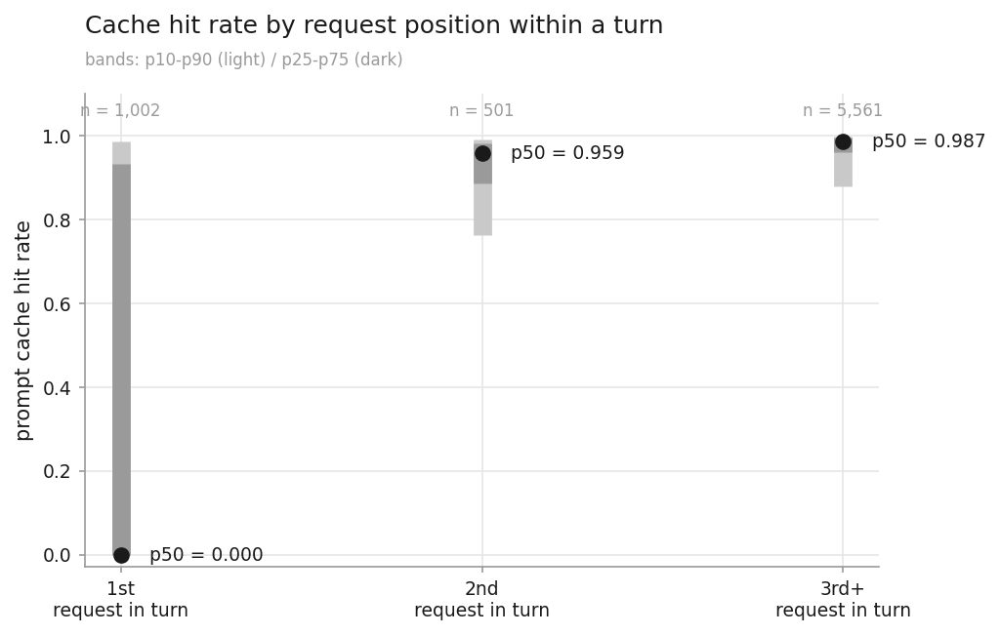
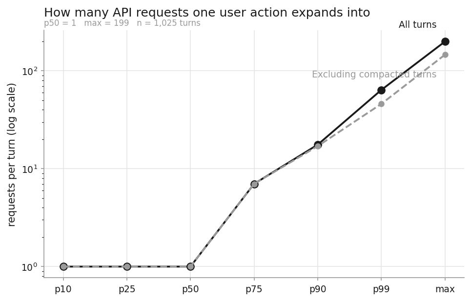
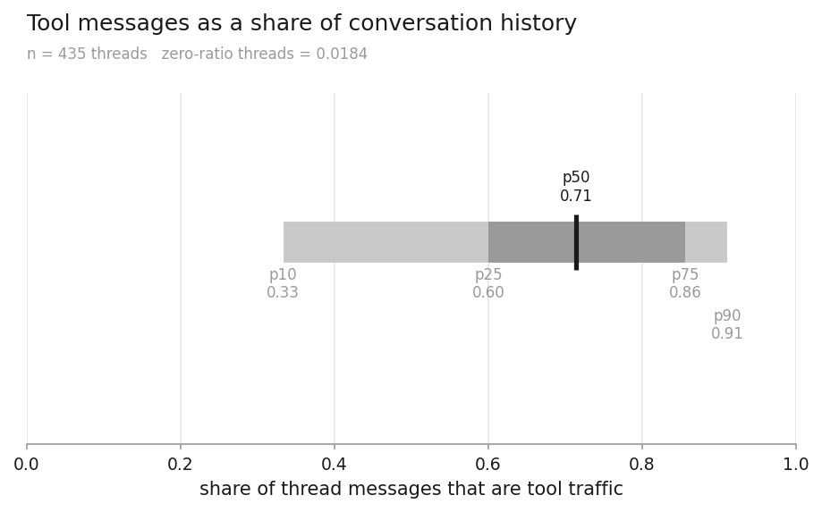

# 統計結果

這份文件是 2026-07-21 到 07-23 這批 gateway 日誌的完整統計結果。
指標怎麼定義的、各自有什麼限制，在 [INDEX.md](INDEX.md);
原始 csv 在 [data/](data/)，想自己算的話從那裡拿。

`AUTOGEN` 標記之間的數字由管線產生，重跑會更新。標記以外的文字是手寫的，不會被覆寫。

---

## 一、這批資料是什麼

<!-- AUTOGEN:SCALE:START -->
- **n_requests**：9,937
- **n_turns**：1,025
- **n_threads**：435
- **n_users**：98
- **n_days**：3
- **n_columns**：89
- **requests_on_2026-07-21**：3,336 — 週二（weekday_taipei=1）、60 人
- **requests_on_2026-07-22**：4,802 — 週三（weekday_taipei=2）、70 人
- **requests_on_2026-07-23**：1,799 — 週四（weekday_taipei=3）、11 人
- **codex 請求無 turn_id**：4 — 3 個 thread、3 人；全部 endpoint=/v1/responses、status=200、text_format_name=codex_output_schema；同形狀的請求另有 18 筆帶著 turn_id，故『缺 turn_id』本身無規律，未併入任何 turn
- **ts_first**：2026-07-21 13:20:13.625759+08:00
- **ts_last**：2026-07-23 07:56:46.130025+08:00

完整資料：[dataset_scale.csv](data/dataset_scale.csv)
<!-- AUTOGEN:SCALE:END -->

四層母數逐層下降不是資料有缺，是本來就該這樣。一個人在 Codex 裡打一句話，
背後可能觸發十幾次 API 呼叫——他讀檔、跑指令、再讀結果，每一步都是一次請求。
所以 9,937 這個數字回答的是「gateway 收到多少流量」，不是「有多少人做了多少事」。

要問「大家打了幾句話」看 turn，要問「做了幾件事」看 thread，要問「多少人在用」看 user。
拿 request 當分母算什麼都會偏高，而且偏高的倍率因人而異——後面〈一次動作被展開成幾個請求〉
那節會看到，有的人一句話只發一個請求，有的人一句話發了 199 個。

另外有 4 筆請求卡在中間：它們有 `thread_id` 但沒有 `turn_id`，
所以在任何以 turn 為母體的統計裡都不存在。查過了，那是把整段對話壓成單一訊息、
掛上輸出格式再送一次的呼叫，四筆的 prompt 都在二十萬字元上下。
但同樣形狀的請求另外有 18 筆是帶著 `turn_id` 的，所以「為什麼這 4 筆沒有」找不到規律，
就照實記成 4 筆，沒有硬塞進任何 turn。

### 走哪個入口

<!-- AUTOGEN:ENDPOINT:START -->
| endpoint | n_requests | n_users | n_threads | request_share |
| --- | --- | --- | --- | --- |
| /v1/responses | 7,237 | 83 | 435 | 0.7283 |
| /v1/chat/completions | 2,401 | 17 | 0 | 0.2416 |
| /v1/audio/speech | 233 | 3 | 0 | 0.0234 |
| /v1/audio/transcriptions | 59 | 2 | 0 | 0.0059 |
| /v1/images/generations | 6 | 2 | 0 | 0.0006 |
| /v1/images/edits | 1 | 1 | 0 | 0.0001 |

完整資料：[requests_by_endpoint.csv](data/requests_by_endpoint.csv)
<!-- AUTOGEN:ENDPOINT:END -->

端點是「拿來做什麼」最可靠的線索，因為它不需要看內容就能分辨用途。
語音合成、語音轉錄、圖片生成這三個各自對應到很具體的事——有人在做語音，
有人在做逐字稿，有人在生圖。雖然量都很小，但那是實實在在的用途訊號。

麻煩的是 `/v1/responses` 佔了七成多，而它底下什麼都有。同一個端點可能是在寫程式、
翻譯、查資料、或是讓 agent 跑一整套任務，從欄位上分不出來。所以端點能告訴我們
「有人在做語音」，卻不能告訴我們「大部分人在寫程式」——後者我們其實不知道。

還有一件事值得看:`n_threads` 只有 `/v1/responses` 那一列非零，其他五個端點全是 0。
這不是漏算，是 thread 這個結構本來就只有 Codex 系列客戶端才有。
所以這一欄實際上是在區分客戶端，不是在區分端點。

### 誰在用

<!-- AUTOGEN:ACCOUNT_TYPE:START -->
| account_type | n_users | n_requests | n_threads | n_turns | request_share | user_share |
| --- | --- | --- | --- | --- | --- | --- |
| student | 43 | 4,175 | 109 | 255 | — | — |
| staff | 44 | 3,587 | 197 | 465 | 0.3610 | 0.4490 |
| service | 11 | 2,175 | 129 | 305 | 0.2189 | 0.1122 |

※ `student` 列的比例已抑制：account_type：單人佔 41.2% > 30%

完整資料：[requests_by_account_type.csv](data/requests_by_account_type.csv)
<!-- AUTOGEN:ACCOUNT_TYPE:END -->

<!-- AUTOGEN:CLIENT_TYPE:START -->
| client_type | n_requests | n_users | n_threads | n_turns | request_share |
| --- | --- | --- | --- | --- | --- |
| codex | 7,115 | 76 | 435 | 1,025 | 0.7160 |
| direct | 2,822 | 25 | 0 | 0 | — |

※ `direct` 列的比例已抑制：client_type：單人佔 61.0% > 30%

完整資料：[requests_by_client_type.csv](data/requests_by_client_type.csv)
<!-- AUTOGEN:CLIENT_TYPE:END -->

98 這個人數是下界不是精確值。帳號的末三碼被遮罩成 `XXX`，而那三碼正好是班級序號，
所以同一個班、同一個編號區段的不同人，遮罩之後會長得一模一樣。
最嚴重的一個帳號底下掛了 11 個不同的使用者 ID——那大概是 11 個人，不是一個人的 11 台機器。
我們最後是用 gateway 自己指派的使用者 ID 當人的鍵，不是用帳號，
否則整批人會被壓成 51 個。

兩種客戶端的切分很乾淨，幾乎不用判斷:Codex 系列一定帶 `thread_id`，
直接呼叫 API 的一定沒有，中間沒有灰色地帶。有九個欄位的覆蓋率完全跟著這條線走，
包括推理強度、快取鍵、串流設定等等，等於是同一組客戶端的指紋。

不過直呼那一組要小心。表面上是 25 個人，實際上其中一個人就佔了該組六成的請求、
八成多的 token。所以「直呼使用者平均怎麼樣」這句話講出來幾乎沒有意義，
它描述的是一支腳本，不是 25 個人的行為。這也是為什麼那一格的比例被抑制掉了。

### 用哪些模型

<!-- AUTOGEN:MODEL_FAMILY:START -->
| model_family | n_requests | n_users | request_share |
| --- | --- | --- | --- |
| gpt-5.4-mini | 3,236 | 47 | 0.3260 |
| gpt-4o-mini | 1,712 | 7 | 0.1723 |
| gpt-5.6-sol | 1,602 | 22 | 0.1612 |
| gpt-5.6-luna | 1,108 | 50 | 0.1115 |
| gpt-5.6-terra | 633 | 27 | 0.0637 |
| gpt-5.4 | 605 | 23 | 0.0609 |
| gpt-5-chat-latest | 416 | 1 | 0.0419 |
| gpt-4o-mini-tts | 214 | 2 | 0.0215 |
| gpt-5.5 | 141 | 14 | 0.0142 |
| gpt-oss:20b | 61 | 2 | 0.0061 |
| (未記錄) | 2 | 1 | — |

其餘 17 列

| model_family | n_requests | n_users | request_share |
| --- | --- | --- | --- |
| whisper-1 | 59 | 2 | 0.0059 |
| gpt-4.1 | 40 | 2 | 0.0040 |
| gpt-5-mini | 23 | 2 | 0.0023 |
| tts-1 | 19 | 1 | 0.0019 |
| bge-m3:latest | 18 | 1 | 0.0018 |
| gpt-4o | 16 | 3 | 0.0016 |
| gpt-5 | 8 | 1 | 0.0008 |
| gpt-4.1-nano | 7 | 2 | 0.0007 |
| gpt-image-1 | 4 | 1 | 0.0004 |
| chat-latest | 3 | 1 | 0.0003 |
| o4-mini | 2 | 1 | 0.0002 |
| gpt-5.3-codex | 2 | 2 | 0.0002 |
| gpt-5.1-codex-max | 2 | 1 | 0.0002 |
| gpt-4.1-mini | 1 | 1 | 0.0001 |
| gpt-5.6 | 1 | 1 | 0.0001 |
| gpt-image-2 | 1 | 1 | 0.0001 |
| o3-deep-research | 1 | 1 | 0.0001 |

完整資料：[requests_by_model_family.csv](data/requests_by_model_family.csv)
<!-- AUTOGEN:MODEL_FAMILY:END -->

27 個模型族聽起來很多，但前六名就佔了將近九成，尾巴有十個模型族的請求數不到五筆——
那些是有人試了一下就沒再用了。

這張表有一個地方會誤導。`gpt-4o-mini` 排第二，一千七百多筆，
但那不是「有很多人在用這個模型」——其中一個帳號就佔了 96%，
剩下六個人加起來只有六十幾筆。真實情況是一支自動化工具加上六次零星試用，
詳見下面〈兩個值得注意的使用者〉。這也是為什麼模型排行要配著 `n_users` 一起看。

另外提醒一件事：這張表的模型名是剝掉日期後綴之後的。原始欄位裡
`gpt-5.4-mini` 和 `gpt-5.4-mini-2026-03-17` 是兩個不同的字串，
如果不做這一步，直接比對「請求的模型」和「回應的模型」，
會算出將近六成的請求「被換了模型」。實際上真正換過模型族的只有一筆。

### 服務狀況

<!-- AUTOGEN:STATUS:START -->
| 類別 | 值 | n_requests | n_users |
| --- | --- | --- | --- |
| status_code | 200 | 9,851 | 98 |
| status_code | 400 | 84 | 6 |
| status_code | 404 | 1 | 1 |
| status_code | 520 | 1 | 1 |
| status_code | 429 | 0 | 0 |
| status_code | 402 | 0 | 0 |
| status_code | 403 | 0 | 0 |
| error_code | context_length_exceeded | 47 | 1 |
| error_code | invalid_value | 18 | 2 |
| error_code | unsupported_parameter | 8 | 3 |
| error_code | (無) | 7 | 3 |
| 彙總 | success_2xx | 9,851 | 98 |
| 彙總 | error_4xx_5xx | 86 | 7 |

其餘 3 列

| 類別 | 值 | n_requests | n_users |
| --- | --- | --- | --- |
| error_code | invalid_json_schema | 2 | 1 |
| error_code | unknown_parameter | 2 | 1 |
| error_code | missing_required_parameter | 2 | 1 |

完整資料：[status_and_errors.csv](data/status_and_errors.csv)
<!-- AUTOGEN:STATUS:END -->

兩件事值得講。

第一，429、402、403 全部是零筆。這代表這段期間 gateway 沒有做任何技術性的額度阻擋——
沒有人被限流、被扣款拒絕、或被權限擋下。這句話的用處是反過來的:
如果之後有人問「某某人用量很低，是不是被卡住了」，答案是沒有，系統沒擋過任何人。

第二，86 筆失敗裡沒有一筆是 gateway 自己的問題。絕大多數是客戶端送錯參數
(送了不支援的推理強度、不該有的溫度值、不存在的模型名)，剩下一筆是上游回了 520。
有七筆連 `error_code` 都沒有，查過之後發現六筆是有 error 物件但沒填 code，
一筆是連 error 物件都沒有的上游異常——所以表上補了「(無)」這一列，讓加總對得起來。

### 兩個值得注意的使用者

<!-- AUTOGEN:ANOMALY:START -->
| 異常類型 | n_users | n_requests | 佔比 | 特徵描述 |
| --- | --- | --- | --- | --- |
| context_length_exceeded 集中 | 1 | 47 | 0.0047 | 單一 direct 使用者，佔該錯誤全部 47 筆中的 47 筆；失敗全部落在 20 分鐘的同一個時窗內，其中 35 次的 prompt_len 都是 150,029 字元（同一份 payload 反覆送出）。相鄰請求間隔中位數 6.2 秒，80% 的間隔落在中位數的 0.5–2 倍區間。該帳號全期共 416 個請求、失敗率 11.3%，全部走 /v1/chat/completions／gpt-5-chat-latest，user_agent 只有 1 種 |
| 舊模型族（gpt-4o-mini）集中 | 1 | 1,648 | 0.1658 | 該模型族共 1,712 筆、7 人，單一使用者就佔 96.3%；其餘 6 人合計僅 64 筆。該使用者 100% 直呼、100% 走 /v1/chat/completions，user_agent 集中於單一 SDK 版本（最常見者佔 100%）。相鄰請求間隔中位數 10.8 秒，94% 的間隔落在中位數的 0.5–2 倍區間——節奏規律，與自動化一致 |
| 離峰時段（0–7 時）單人集中 | 1 | 1,645 | 0.1655 | 離峰時段共 1,972 筆、17 人，其中 83.4% 來自單一使用者。該帳號 account_type=student（**不是** service 服務帳號），全期 1,720 個請求佔全體 17.3%、佔 direct 流量 60.9%，其中 95.6% 落在離峰時段，活躍天數僅 2 天。相鄰請求間隔中位數 10.8 秒，90% 的間隔落在中位數的 0.5–2 倍區間（與第 2 列為同一帳號） |

完整資料：[anomaly_profile.csv](data/anomaly_profile.csv)
<!-- AUTOGEN:ANOMALY:END -->

這兩位不是要排除的雜訊。如果不先講清楚，前面好幾張表都會被讀錯。

**第一位是一支持續運行的自動化工具。** 兩天之內產生了全校六成的直呼流量、
八成多的直呼 token。九成五以上的請求落在凌晨零點到七點，相鄰請求的間隔中位數 10.8 秒，
而且九成四的間隔都落在中位數的 0.5 到 2 倍之間——這種規律性人做不出來，是排程。

要特別點出來，是因為它同時影響三張表的讀法：它讓 `client_type=direct` 的比例被抑制、
讓 `gpt-4o-mini` 在模型排行裡看起來像第二熱門、也讓凌晨五點那格的 252 筆
看起來像「有人在熬夜工作」。三個看起來不相干的觀察，其實是同一支程式的節奏。

還有一點跟直覺相反：這個帳號的類型是**學生**，不是服務帳號。
原本會猜「凌晨規律跑的一定是自動化帳號」，資料不支持這個猜測。
所以帳號類型不能拿來推斷背後是不是人在操作——這在算「多少人在用」的時候要留意。

**第二位是一個沒有錯誤處理的重試迴圈。** 47 筆上下文長度超限的錯誤，
全部來自這一個人，而且全部擠在同一天下午的二十分鐘之內。
其中 35 筆的 prompt 長度完全相同(十五萬字元)，也就是同一份東西反覆送。
相鄰間隔中位數 6.2 秒——撞牆之後沒有退避、沒有縮短輸入，直接重試。

這個帳號全期 416 個請求，失敗率 11.3%，幾乎全部的失敗都來自這二十分鐘。
換句話說平常是正常的，只是有一次送了一份太大的東西，而程式沒有處理這個情況。
這 47 次全部白跑，而且下次遇到同樣大小的輸入還是會這樣——
這是這批資料裡少數可以直接回饋給使用者的具體發現。

這兩位都可以由 gateway 管理者從行為特徵對應到具體帳號。
這份文件本身不含使用者 ID，對照表在 `ref/user_registry.csv`，那個檔不進版控。

---

## 二、三個站得住的數字

這一節的三個數字有個共同點：它們描述的是協定和工具的行為，不是人的行為。

這個差別很重要。凡是「哪一群人用得比較多」這類問題，答案都受樣本量限制——
現在只有 1.8 天、98 個人，而且好幾個分組被單一使用者主導，結論隨時會翻。
但「快取在第幾個請求開始生效」不會，那是機制，資料變十倍答案還是一樣。

所以這三個現在就能拿去用，其餘的要配著第三節的限制看。

### 快取在 turn 內的位置效應

<!-- AUTOGEN:CACHE_HIT:START -->
| 分組 | n | p10 | p25 | p50 | p75 | p90 | p99 | max | n_requests | n_turns | zero_cache_share | n_excluded_usage_missing | n_excluded_zero_prompt_tokens |
| --- | --- | --- | --- | --- | --- | --- | --- | --- | --- | --- | --- | --- | --- |
| 1st | 1,002 | 0 | 0 | 0 | 0.9338 | 0.9858 | 0.9984 | 0.9999 | 1,002 | 1,002 | 0.5319 | 47 | 0 |
| 2nd | 501 | 0.7636 | 0.8858 | 0.9591 | 0.9816 | 0.9906 | 0.9971 | 0.9995 | 501 | 501 | 0.0279 | 47 | 0 |
| 3rd+ | 5,561 | 0.8807 | 0.9606 | 0.9868 | 0.9949 | 0.9974 | 0.9992 | 0.9998 | 5,561 | 445 | 0.0156 | 47 | 0 |

完整資料：[cache_hit_by_request_position.csv](data/cache_hit_by_request_position.csv)
<!-- AUTOGEN:CACHE_HIT:END -->

分界乾淨到有點誇張：一個 turn 裡的第一個請求，快取命中率中位數是 0，
而且有超過一半的第一個請求完全沒命中任何快取。到第二個請求，中位數直接跳到 0.96。
第三個以後穩定在 0.99。

原因不神秘。Codex 每次請求都會把整段對話歷史重送一次，
所以第二個請求的前綴跟第一個高度重疊，供應商那邊直接命中前綴快取。
第一個請求沒有前面的東西可以命中，自然是 0。

這件事的意義在於：**不能拿快取命中率去比較使用者**。
一個人的命中率高，只代表他的對話比較長、請求比較多，不代表他用得比較好或比較省。
真要說的話，命中率低的人反而是「每次都問新問題」的人。

直接的後果是 token 數會被嚴重高估:

<!-- AUTOGEN:TOKEN_INFLATION:START -->
| client_type | 分組 | n_requests | n_users | p10 | p25 | p50 | p75 | p90 | p99 | max | n_excluded_usage_missing | n_excluded_zero_denominator |
| --- | --- | --- | --- | --- | --- | --- | --- | --- | --- | --- | --- | --- |
| codex | codex | 7,068 | 76 | 1.99 | 13.7 | 52.2 | 157 | 341 | 1,173 | 7,434 | 188 | 59 |
| direct | direct | 2,622 | 23 | — | — | — | — | — | — | — | 188 | 59 |

※ `direct` 列的比例已抑制：client_type：單人佔 61.0% > 30%

完整資料：[token_inflation_by_client_type.csv](data/token_inflation_by_client_type.csv)
<!-- AUTOGEN:TOKEN_INFLATION:END -->

中位數 52 倍。也就是說一個中位的 Codex 請求，
它報出來的 `prompt_tokens` 是實際新增內容的五十幾倍，因為快取命中的部分每次都重新計入。
p90 到三百多倍，最極端的一筆超過七千倍。

所以任何「總 token 用量」的數字都要先講清楚是哪一種:
是原始 `prompt_tokens` 加總(會爆)，還是扣掉快取的部分(才是實際新增的量)。
這兩個數字差了一到兩個數量級，混用會得出完全不同的結論。

### 一次動作被展開成幾個請求

<!-- AUTOGEN:EXPANSION:START -->
| 統計量 | 全體 | 排除有壓縮的 turn |
| --- | --- | --- |
| n_turns | 1,025 | 1,006 |
| p10 | 1 | 1 |
| p25 | 1 | 1 |
| p50 | 1 | 1 |
| p75 | 7 | 7 |
| p90 | 17.6 | 17 |
| p99 | 63.8 | 46.0 |
| max | 199 | 146 |
| single_request_share | 0.5083 | 0.5179 |
| mean（僅供對照，勿引用） | 6.94 | 6.12 |
| n_turns_with_compaction | 19 | 0 |

完整資料：[turn_expansion_depth.csv](data/turn_expansion_depth.csv)
<!-- AUTOGEN:EXPANSION:END -->

中位數是 1，最大值是 199。這種形狀的分布，平均值完全沒有意義——
表上還是列了 mean(6.94)，但標了「僅供對照，勿引用」，
因為它同時被「一半的動作只發一個請求」和「少數動作發了上百個請求」兩件事拉扯，
它描述不了任何一群人。

實際情況比較像兩種用法並存：一半的時候使用者是在問問題，問完就結束;
另一半的時候他是把任務丟給 agent，然後 agent 自己讀檔、跑指令、修改、再驗證，
一路展開下去。第 75 百分位是 7，第 90 百分位接近 18。

右邊那一欄是排除掉發生過「上下文壓縮」的 turn。
壓縮是 Codex 的自保機制：對話太長時，它會先發一個請求把歷史摘要掉，
然後用短版歷史繼續——但 `turn_id` 不變，所以同一個 turn 裡其實裝了前後兩段對話。
這種 turn 有 19 個。

比較兩欄可以看到，它們只影響尾端：中位數和第 75 百分位完全沒動，
p99 從 63.8 掉到 46.0，最大值從 199 掉到 146。
所以引用中位數的結論不受影響，只有在講「最深展開到幾次」的時候要看右欄。

### 對話裡有多少是工具往返

<!-- AUTOGEN:TOOL_RATIO:START -->
| 分組 | n | p10 | p25 | p50 | p75 | p90 | p99 | max | zero_ratio_share |
| --- | --- | --- | --- | --- | --- | --- | --- | --- | --- |
| 全體 thread | 435 | 0.3333 | 0.6000 | 0.7143 | 0.8561 | 0.9109 | 0.9770 | 0.9868 | 0.0184 |

完整資料：[thread_tool_message_ratio.csv](data/thread_tool_message_ratio.csv)
<!-- AUTOGEN:TOOL_RATIO:END -->

一個 thread 的訊息裡，中位數有 71% 既不是使用者講的，也不是模型回的，
而是工具呼叫和工具回傳的結果。第 90 百分位到 91%。
只有 1.8% 的 thread 完全沒有工具訊息——也就是純粹一問一答的用法其實很少。

這是全專案條件最乾淨的一個數字，值得說明為什麼:
435 個 thread 全部納進來，沒有母數不足的問題；分布很平均，沒有被單一使用者主導;
分子分母都取同一個時點，所以不受上下文壓縮影響；而且完全不需要讀任何內容，
只用三個訊息計數欄位相減就得到了。

它回答的是「怎麼用」——大部分時候人是在讓 agent 代跑任務，不是在跟它聊天。
但它不回答「用來做什麼」，因為那七成工具往返的內容我們看不到。

那麼掛了哪些工具呢?這個看得到一部分:

<!-- AUTOGEN:TOOL_TYPES:START -->
| tool_type | n_threads | n_users | declared_thread_share |
| --- | --- | --- | --- |
| function | 185 | 54 | 1.0000 |
| custom | 183 | 53 | 0.9892 |
| tool_search | 177 | 53 | 0.9568 |
| web_search | 142 | 54 | 0.7676 |
| namespace | 113 | 46 | 0.6108 |
| （分母）有工具宣告的 thread | 185 | 54 | — |
| （分母）無 tool_types 欄位的 thread | 250 | 53 | — |

完整資料：[tool_types_distribution.csv](data/tool_types_distribution.csv)
<!-- AUTOGEN:TOOL_TYPES:END -->

先講分母，因為它很容易被誤讀。435 個 thread 裡只有 185 個帶了工具宣告欄位，
其餘 250 個根本沒有這個欄位(多半是標題生成、子代理那類輔助呼叫)。
所以表上的比例分母是 185 不是 435，`function` 那格的 1.0 意思是
「有工具宣告的 thread 全部都掛了 function」，不是「所有 thread 都掛了」。

`web_search` 出現在其中七成七的 thread，`custom` 接近 99%——後者通常代表
使用者自己接了工具或 MCP server。這算是一個治理訊號：有相當比例的使用透過 gateway
連到了外部，而且掛了自訂的東西。

但有一個很大的保留：**這是「宣告掛載」不是「實際呼叫」**。
客戶端在請求裡宣告它允許模型用哪些工具，不代表模型真的用了。
掛了 `web_search` 的那七成七 thread 裡，有多少真的搜過網路，資料裡沒有任何欄位能分辨。
真正的呼叫紀錄在串流回應裡，而那部分沒有被保留下來。

---

## 三、這批資料不能說什麼

這一節列了七項限制，但真正的重點只有一句話:
**這批資料能可靠回答「系統怎麼運作」，不能回答「哪群人用得比較多」。**

前者是機制，1.8 天就夠了；後者需要更多資料和更均勻的分布，
而現在 32 個分組值裡只有 4 個通過門檻。
所以下面七項與其說是限制，不如說是在標出那條界線在哪裡。

### 幾乎所有族群比較都不能做

<!-- AUTOGEN:CONCENTRATION:START -->
| 維度 | n_groups | n_usable | n_below_min_group_size | n_dominant | 可用分組值 | 全部分組皆可出比例 |
| --- | --- | --- | --- | --- | --- | --- |
| account_type | 3 | 2 | 0 | 1 | staff,service | 否 |
| client_type | 2 | 1 | 0 | 1 | codex | 否 |
| dept_code | 16 | 1 | 15 | 15 | 29 | 否 |
| degree | 3 | 0 | 1 | 3 | （無） | 否 |
| entry_year | 8 | 0 | 5 | 8 | （無） | 否 |

_此表為 run metadata（`runs/<run_id>/concentration_summary.csv`），描述抑制規則本身而非使用行為，不隨指標 csv 發布。_
<!-- AUTOGEN:CONCENTRATION:END -->

我們對每個分組設了兩道門檻：人數少於 10 的不出比例，
單一使用者佔該組流量超過 30% 的也不出比例。
兩道門檻是在看到任何數字之前就定死的，這點很重要——
如果是看到結果才調門檻，那結論就沒有底線了。

結果是 32 個分組值只有 4 個同時通過。

碩士生那組是最好的例子。12 個人，過了人數門檻，
但其中一個人佔了該組 82.8% 的流量。如果當初只設了人數這一道，
「碩士生的平均用量」就會被寫進報告，而那個數字其實在描述一個人。
兩道門檻都要，少一道就會漏。

<!-- AUTOGEN:DEGREE_YEAR:START -->
| degree | entry_year | n_users | n_requests | n_threads | user_share | request_share |
| --- | --- | --- | --- | --- | --- | --- |
| B | 9 | 1 | 7 | 0 | — | — |
| B | 10 | 1 | 3 | 1 | — | — |
| B | 11 | 4 | 59 | 3 | — | — |
| B | 12 | 13 | 1,639 | 44 | — | — |
| B | 13 | 4 | 120 | 7 | — | — |
| B | 14 | 3 | 154 | 10 | — | — |
| D | 8 | 1 | 11 | 3 | — | — |
| D | 13 | 2 | 45 | 15 | — | — |
| D | 14 | 2 | 59 | 7 | — | — |
| M | 13 | 4 | 24 | 2 | — | — |
| M | 14 | 7 | 1,957 | 17 | — | — |
| M | 15 | 1 | 97 | 0 | — | — |

※ `B / 9` 列的比例已抑制：degree：單人佔 30.6% > 30%；entry_year：母數 1 < 10、單人佔 100.0% > 30%
※ `B / 10` 列的比例已抑制：degree：單人佔 30.6% > 30%；entry_year：母數 1 < 10、單人佔 100.0% > 30%
※ `B / 11` 列的比例已抑制：degree：單人佔 30.6% > 30%；entry_year：母數 4 < 10、單人佔 67.8% > 30%
※ `B / 12` 列的比例已抑制：degree：單人佔 30.6% > 30%；entry_year：單人佔 37.0% > 30%
※ `B / 13` 列的比例已抑制：degree：單人佔 30.6% > 30%；entry_year：單人佔 30.2% > 30%
※ `B / 14` 列的比例已抑制：degree：單人佔 30.6% > 30%；entry_year：單人佔 79.3% > 30%
※ `D / 8` 列的比例已抑制：degree：母數 5 < 10、單人佔 39.1% > 30%；entry_year：母數 1 < 10、單人佔 100.0% > 30%
※ `D / 13` 列的比例已抑制：degree：母數 5 < 10、單人佔 39.1% > 30%；entry_year：單人佔 30.2% > 30%
※ `D / 14` 列的比例已抑制：degree：母數 5 < 10、單人佔 39.1% > 30%；entry_year：單人佔 79.3% > 30%
※ `M / 13` 列的比例已抑制：degree：單人佔 82.8% > 30%；entry_year：單人佔 30.2% > 30%
※ `M / 14` 列的比例已抑制：degree：單人佔 82.8% > 30%；entry_year：單人佔 79.3% > 30%
※ `M / 15` 列的比例已抑制：degree：單人佔 82.8% > 30%；entry_year：母數 1 < 10、單人佔 100.0% > 30%

完整資料：[users_by_degree_and_entry_year.csv](data/users_by_degree_and_entry_year.csv)
<!-- AUTOGEN:DEGREE_YEAR:END -->

比例欄整片空白是預期的，不是計算失敗。但計數欄全部保留，
因為計數和比例的風險不一樣：「43 個學生分布在 12 個學位×學年組合」是事實陳述，
講出來不會誤導誰；「碩士生佔了多少比例」則會讓人以為那描述了一群人。

還有一個結構性的限制值得記下來：教職員的帳號遮罩之後只剩流水號，
推不出系所也推不出年份，而學生的帳號還保留了入學年和系所碼。
所以這類人口統計分析，結構上只能對學生做，教職員那半只能當一個整體看。
這是遮罩方式決定的，不是分析上的取捨。

### 時段分布不能外推

<!-- AUTOGEN:HOUR:START -->
| hour_taipei | n_requests | n_users | request_share |
| --- | --- | --- | --- |
| 0 | 133 | 9 | 0.0134 |
| 1 | 147 | 9 | 0.0148 |
| 2 | 396 | 6 | 0.0399 |
| 3 | 292 | 4 | 0.0294 |
| 4 | 271 | 3 | 0.0273 |
| 5 | 252 | 1 | 0.0254 |
| 6 | 284 | 2 | 0.0286 |
| 7 | 197 | 3 | 0.0198 |
| 8 | 156 | 8 | 0.0157 |
| 9 | 140 | 10 | 0.0141 |

其餘 14 列

| hour_taipei | n_requests | n_users | request_share |
| --- | --- | --- | --- |
| 10 | 300 | 14 | 0.0302 |
| 11 | 346 | 14 | 0.0348 |
| 12 | 681 | 12 | 0.0685 |
| 13 | 492 | 26 | 0.0495 |
| 14 | 869 | 34 | 0.0875 |
| 15 | 1,077 | 29 | 0.1084 |
| 16 | 1,016 | 24 | 0.1022 |
| 17 | 405 | 18 | 0.0408 |
| 18 | 672 | 16 | 0.0676 |
| 19 | 489 | 12 | 0.0492 |
| 20 | 332 | 17 | 0.0334 |
| 21 | 393 | 12 | 0.0395 |
| 22 | 368 | 17 | 0.0370 |
| 23 | 229 | 12 | 0.0230 |

完整資料：[requests_by_hour.csv](data/requests_by_hour.csv)
<!-- AUTOGEN:HOUR:END -->

只有 1.8 天，而且橫跨的三個日期裡頭尾兩天都不完整。
這張表是「這 1.8 天的請求落在哪些小時」的事實描述，不能拿來談作息、
不能拿來找尖峰、更不能拿來排容量。

`n_users` 那一欄是這張表最該看的地方。凌晨五點有 252 筆請求，
數字看起來不小，但那一格只有一個使用者——那是前面提過的那支排程腳本的節奏，
不是「有人在凌晨工作」。同樣的，幾個看起來活躍的時段，
如果 `n_users` 是個位數，那描述的就是少數幾個人的習慣，不是校內的作息。

### 七成流量的模型無法獨立驗證

<!-- AUTOGEN:MODEL_CONSISTENCY:START -->
- **n_requests（全體）**：9,937／1.0000
- **response_model 有值**：1,958／0.1970 — 缺值代表該請求沒有回應摘要（多為錯誤或非對話端點）
- **兩欄皆有值（可比對）**：1,958／0.1970
- **原字串完全一致**：1,958／1.0000 — 含版本後綴
- **模型族一致**：1,958／1.0000 — 剝除 -YYYY-MM-DD 後綴後比對
- **模型族不一致**：0／0.0000 — 這才是真正的模型替換
- **可比對範圍：client_type=codex**：0／0.0000 — 該組共 7115 筆，**完全無法比對**
- **可比對範圍：client_type=direct**：1,958／0.6938 — 該組共 2822 筆
- **可比對範圍：endpoint=/v1/audio/speech**：0／0.0000 — 該組共 233 筆，**完全無法比對**
- **可比對範圍：endpoint=/v1/audio/transcriptions**：0／0.0000 — 該組共 59 筆，**完全無法比對**
- **可比對範圍：endpoint=/v1/chat/completions**：1,878／0.7822 — 該組共 2401 筆
- **可比對範圍：endpoint=/v1/images/edits**：0／0.0000 — 該組共 1 筆，**完全無法比對**
- **可比對範圍：endpoint=/v1/images/generations**：0／0.0000 — 該組共 6 筆，**完全無法比對**
- **可比對範圍：endpoint=/v1/responses**：80／0.0111 — 該組共 7237 筆

完整資料：[model_consistency.csv](data/model_consistency.csv)
<!-- AUTOGEN:MODEL_CONSISTENCY:END -->

這一項本來是想驗證「gateway 有沒有偷換模型」。
資料裡有三個模型欄位：客戶端請求的、gateway 記錄回傳的，
以及供應商回應摘要裡的。前兩個都是 gateway 自己寫的，拿它們互相比對等於自己驗自己;
第三個才是獨立的來源。

比對結果是 1,958 筆完全一致，連版本日期後綴都一模一樣，零筆不符。
聽起來很好，問題是那 1,958 筆全部是直呼流量。
7,115 筆 Codex 請求裡，一筆都沒有第三個欄位。

所以這個檢查沒有達成它的目的。「模型替換率 0.01%」這個數字在主要流量上，
仍然只是 gateway 兩個自家欄位的互證。要真的補上，
需要請上游在 `/v1/responses` 的回應摘要裡也記下模型名——
這一條已經列進待跟 gateway 端討論的清單。

值得特別講的是，這是一個設計得很仔細但驗不到目標的檢查。
把它照實寫出來，比讓「100% 一致」這個數字單獨掛在那裡好——
後者會讓人以為問題解決了。

### 有 188 筆的用量是遺失不是零

<!-- AUTOGEN:USAGE_MISSING:START -->
| 類別 | 值 | n_requests | 佔全體請求 | n_users |
| --- | --- | --- | --- | --- |
| endpoint | /v1/chat/completions | 134 | 0.0135 | — |
| endpoint | /v1/responses | 52 | 0.0052 | — |
| endpoint | /v1/images/generations | 1 | 0.0001 | — |
| endpoint | /v1/images/edits | 1 | 0.0001 | — |
| status_code | 200 | 102 | 0.0103 | — |
| status_code | 400 | 84 | 0.0085 | — |
| status_code | 404 | 1 | 0.0001 | — |
| status_code | 520 | 1 | 0.0001 | — |
| stream | True | 179 | 0.0180 | — |
| stream | False | 9 | 0.0009 | — |
| 彙總 | usage_missing 總筆數 | 188 | 0.0189 | 22 |
| 彙總 | 其中 status=200（token 真正遺失） | 102 | 0.0103 | 18 |
| 彙總 | 其中 status>=400（沒送到模型，無用量屬正常） | 86 | 0.0087 | 7 |

其餘 2 列

| 類別 | 值 | n_requests | 佔全體請求 | n_users |
| --- | --- | --- | --- | --- |
| provider | openai | 170 | 0.0171 | — |
| provider | ollama | 18 | 0.0018 | — |

完整資料：[usage_missing_impact.csv](data/usage_missing_impact.csv)
<!-- AUTOGEN:USAGE_MISSING:END -->

188 筆請求的用量欄位是空的。其中 86 筆是失敗的請求，
沒送到模型自然沒有用量，那很合理。麻煩的是另外 102 筆:
它們的狀態碼是 200，而且幾乎全是串流請求——請求成功了，
但用量資訊沒有跟著回來，可能是客戶端沒要求，也可能是連線在用量區塊之前就結束了。

這 102 筆的 `total_tokens` 記成 0，但實際上不是 0，是不知道。
如果直接 `sum(total_tokens)`，它們會被當成零消耗算進去，而那是錯的。
所以所有 token 相關的統計都排除了這些列，並且在輸出裡註明排除了幾筆。

比例不高(1.89%)，不影響大方向，但這是那種一旦混進去就再也分不出來的錯誤，
所以在管線裡用一個獨立的布林欄位標記，不讓下游自己去組合條件判斷。

### 只有長度沒有內容

<!-- AUTOGEN:PROMPT_LENGTH:START -->
| client_type | n_requests | n_users | p10 | p25 | p50 | p75 | p90 | p99 | max |
| --- | --- | --- | --- | --- | --- | --- | --- | --- | --- |
| codex | 7,033 | 76 | 11 | 26 | 171 | 654 | 5,426 | 13,815 | 723,731 |
| direct | 2,417 | 21 | — | — | — | — | — | — | — |
| 全體 | 9,450 | 94 | 12 | 44 | 113 | 589 | 4,156 | 44,335 | 900,179 |

※ `direct` 列的比例已抑制：client_type：單人佔 61.0% > 30%；同表彙總列未抑制，本列數值可由對照推得

完整資料：[prompt_length_distribution.csv](data/prompt_length_distribution.csv)
<!-- AUTOGEN:PROMPT_LENGTH:END -->

抽取的時候刻意只保留了字元長度，對話原文不寫進表。
原因是這批資料最終要能推上 GitHub 給人看，而原文裡有本機路徑、專案名稱、
以及使用者實際打的內容。長度足以支撐大部分結構型的分析，原文則是不可逆的風險。

Codex 的中位長度只有 171 字元，看起來很短。這個欄位裝的只有「這一次送出的輸入」，
不含對話歷史，而這點是驗過的不是推測:1,025 個 turn 裡有 997 個(97.3%)
的 prompt_len 從頭到尾是同一個數字，同一批 turn 的 message_count 卻全部在成長;
相鄰請求之間有 99.2% 的 prompt_len 完全不動，會動的幾乎都伴隨 user_message_count
改變(兩者一致率 99.8%)。最極端的一筆是 message_count 560、prompt_len 只有 1——
那個人在一段 560 則訊息的對話裡打了一個「好」。

所以這個數字回答的是「每次按下送出打了多少字」，不是「大家的問題都很短」。
還有兩件事要一起看：一是有 487 筆的長度是 0，其中 399 筆是語音、轉錄、生圖這類
本來就沒有訊息的端點，另外 88 筆是 gateway 記到了空字串;
二是這個欄位裡不全是人打的字，客戶端自己發出的任務說明、檔案附件包裝、
產生建議用的指令也記在同一欄，所以這個分布是「人的輸入」和「客戶端自動產生的輸入」
混在一起的。

順帶交代一個進了表但沒有任何指標使用的欄位:`memory_len`。
它是模型推理摘要的字元長度——原文同樣沒有保留，只留長度。
5,114 筆有值(全部是 Codex 走 `/v1/responses`)，中位 14,472 字元，
在 turn 內只會累積不會減少。不做成指標是因為它量到的東西已經有更直接的欄位:
有推理摘要的請求裡 91.6% 的 `reasoning_tokens` 大於零，沒有的只有 37.3%——
當成「這次有沒有推理」的訊號是準的，但那件事 `reasoning_tokens` 自己就答得了;
而摘要的**長度**與 reasoning_tokens 的相關性只有 0.08(spearman)，
多做一張表只會多一個看起來像發現、實際上被既有欄位蓋過的數字。
它會累積這件事也和 `prompt_tokens` 同一個陷阱：跨請求加總會重複計算。

另外一個常被誤解的欄位是推理強度:

<!-- AUTOGEN:REASONING_EFFORT:START -->
| reasoning_effort | n_requests | n_users | n_turns | request_share |
| --- | --- | --- | --- | --- |
| medium | 4,890 | 66 | 678 | 0.6873 |
| high | 980 | 11 | 61 | 0.1377 |
| low | 647 | 63 | 238 | 0.0909 |
| xhigh | 598 | 9 | 48 | 0.0840 |

完整資料：[reasoning_effort_distribution.csv](data/reasoning_effort_distribution.csv)
<!-- AUTOGEN:REASONING_EFFORT:END -->

看起來像是「大家偏好 medium」，實際上不是。
Codex 客戶端送出的請求裡有一個參數欄位，7,115 筆的值完全相同，一個變化都沒有——
也就是說沒有任何使用者調整過設定。所以這張表描述的是客戶端預設值的分布，
以及不同版本客戶端的差異，跟使用者偏好無關。

### 附註：上下文長度上限

<!-- AUTOGEN:CONTEXT_EXCEEDED:START -->
| 類別 | 值 | n | 備註 |
| --- | --- | --- | --- |
| model_family | gpt-5-chat-latest | 47 | — |
| error_param | messages | 47 | — |
| endpoint | /v1/chat/completions | 47 | — |
| client_type | direct | 47 | — |
| prompt_len 字元 | p50 | 150,029 | — |
| prompt_len 字元 | p90 | 150,029 | — |
| prompt_len 字元 | min | 1,894 | — |
| prompt_len 字元 | max | 900,179 | — |
| prompt_tokens（不可信） | p50 | 0 | — |
| prompt_tokens（不可信） | p90 | 0 | — |
| 彙總 | n_requests | 47 | — |
| 彙總 | n_users | 1 | — |
| 彙總 | n_usage_missing | 47 | usage_details 為空，token 欄位不可信 |

其餘 2 列

| 類別 | 值 | n | 備註 |
| --- | --- | --- | --- |
| prompt_tokens（不可信） | min | 0 | — |
| prompt_tokens（不可信） | max | 0 | — |

完整資料：[context_length_exceeded_profile.csv](data/context_length_exceeded_profile.csv)
<!-- AUTOGEN:CONTEXT_EXCEEDED:END -->

47 筆超限錯誤，全部來自同一個人、同一個模型、同一個端點，
而且其中 35 筆的 payload 完全相同。所以這張表描述的是一支腳本的一次失敗，
不是「使用者經常撞到上限」這種普遍現象。

會單獨列出來，是因為如果只看 `status_and_errors` 那張表，
`context_length_exceeded` 佔了所有錯誤的一半以上，很容易被解讀成
「上下文長度是主要的失敗原因」。攤開來看之後才知道那是一個人在二十分鐘內造成的。

順帶，這些請求的 `prompt_tokens` 全部是 0——因為請求被拒絕了，
根本沒有進到模型，所以沒有 token 計數。表上保留了這幾列並標註「不可信」，
是為了讓人知道這個欄位在這個情境下不能用，而不是讓人以為那些請求真的沒有內容。

---

## 資料與重跑

每個指標的原始 csv 在 [data/](data/)，欄位定義和完整的注意事項在 [INDEX.md](INDEX.md)。
想自己重跑或加資料進來，步驟在 [README](../README.md)。

這份文件的數字是某一次執行的快照，不是即時的。
更新的方式是重跑管線並帶 `--publish`，那會同時更新這裡的數字、`data/` 底下的 csv、
以及三張圖，不會有圖是舊的、表是新的這種狀況。
