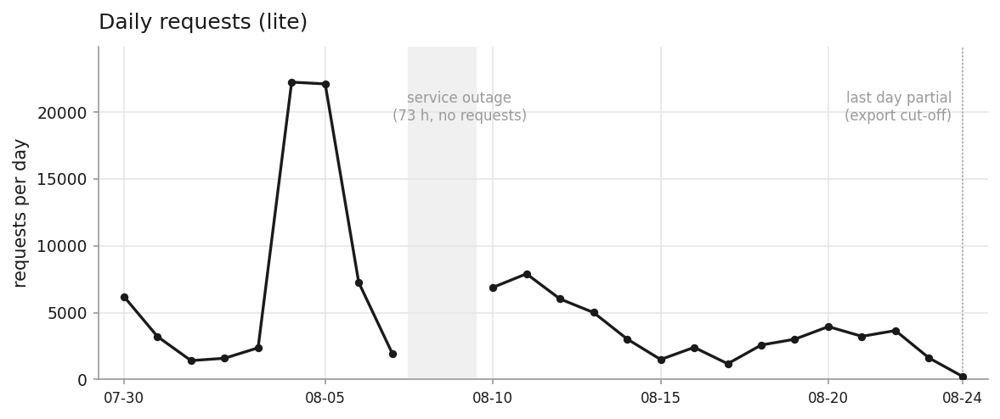
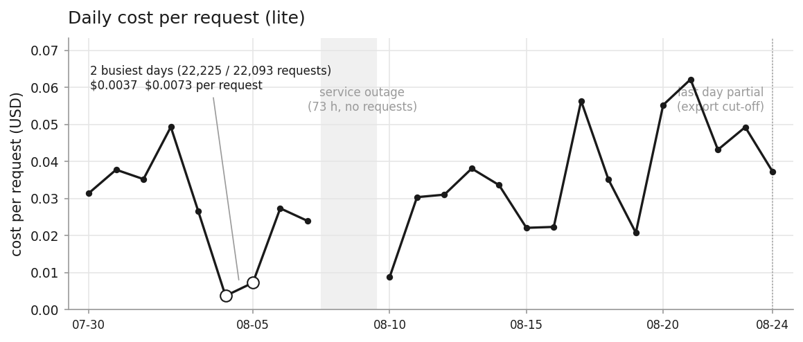
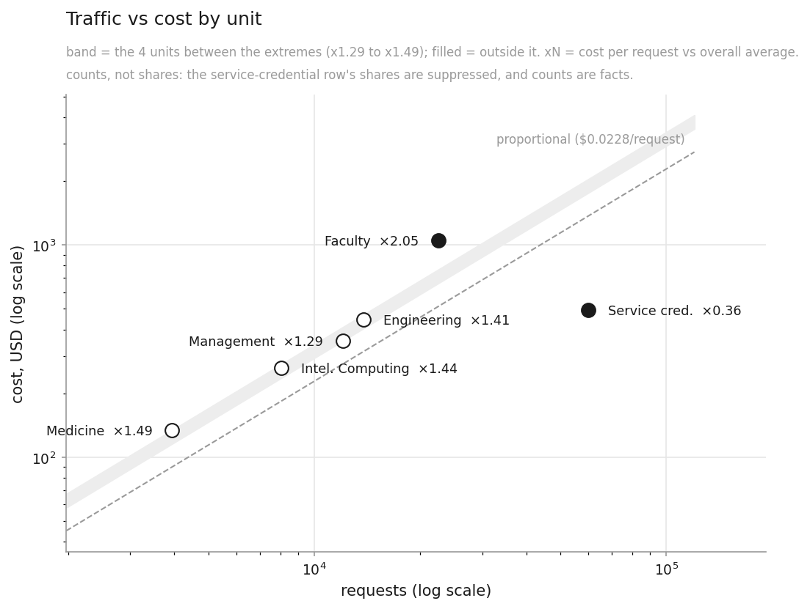
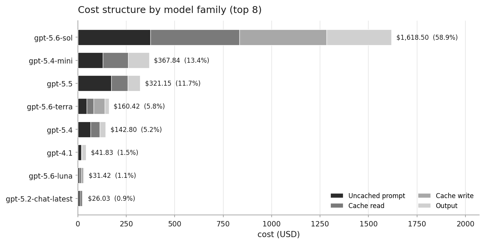

# 統計結果（lite）

這份文件是 2026-07-30 到 08-24 這批 gateway 日誌（lite 匯出）的統計結果。
期間內 08-08 與 08-09 完全沒有請求，那是**服務中斷不是資料遺失**（已查證），
所以是 24 個有資料的曆日而不是 26 天。
指標怎麼定義的、各自有什麼限制，在 [INDEX.md](INDEX.md)；
原始 csv 在 [data_lite/](data_lite/)，想自己算的話從那裡拿。

`AUTOGEN` 標記之間的數字由管線產生，重跑會更新。標記以外的文字是手寫的，不會被覆寫。

> **散文尚未撰寫。** 本檔目前只有管線產生的表格。解讀要等數字定案後再寫，
> 理由與 RESULTS.md 相同：手寫的解讀是這份文件的價值所在，寫在數字還會動的
> 時候只會產生一份要重寫的東西。

## 這批資料與 RESULTS.md 的關係

這不是 [RESULTS.md](RESULTS.md) 的新版本。兩批資料回答不同的問題：

- **RESULTS.md**（1.8 天、9,937 筆）能看到一個 turn 內部發生什麼。
- **本文件**（24 個有資料的曆日、120,520 筆、357 個 uid 其中 275 人）能看到誰在用、花多少。

`cache_hit_by_request_position`、`turn_expansion_depth`、
`token_inflation_by_client_type` 這三個指標**本文件永遠不會有**，不是資料量
不夠，是 lite 的 schema 沒有 `turn_id`。詳見 [INDEX.md](INDEX.md) 的導覽。

**兩條線的人員鍵不同**：lite 用 `anonymous_user_id`，clean 用 `username`。
同一個人在兩批資料裡是不同的 ID，期間也不重疊——兩邊的數字不可互相比較，
也不可相加。

---

## 一、誰在用

### 各單位的請求數

<!-- AUTOGEN:UNIT:START -->
| unit | unit_type | n_users | n_accounts | n_requests | request_share | attributable_share | top1_user_share | top1_account_share | n_users_in_top_account | is_single_dept_college |
| --- | --- | --- | --- | --- | --- | --- | --- | --- | --- | --- |
| 服務憑證 | 服務憑證 | 82 | 15 | 60,075 | 0.4985 | 不適用 | 0.6891 | 0.6891 | 1 | 否 |
| 教職員 | 教職員 | 120 | 20 | 22,524 | 0.1869 | 0.3726 | 0.0993 | 0.4501 | 29 | 否 |
| 工學院 | 學院 | 65 | 35 | 13,814 | 0.1146 | 0.2285 | 0.0848 | 0.3090 | 17 | 否 |
| 管理學院 | 學院 | 33 | 12 | 12,086 | 0.1003 | 0.2000 | 0.2385 | 0.7869 | 17 | 否 |
| 智慧運算學院 | 學院 | 24 | 6 | 8,073 | 0.0670 | 0.1336 | 0.2335 | 0.6114 | 12 | 是 |
| 醫學院 | 學院 | 33 | 31 | 3,948 | 0.0328 | 0.0653 | 0.1679 | 0.1679 | 1 | 否 |

※ `服務憑證` 列unit：非自然人分組，單一識別碼佔 68.9% > 30%，依政策不抑制（抑制保護的是自然人）

完整資料：[requests_by_unit_lite.csv](data_lite/requests_by_unit_lite.csv)
<!-- AUTOGEN:UNIT:END -->

### 各單位的人均與分布

<!-- AUTOGEN:USERS:START -->
| unit | unit_type | n_users | user_share | n_requests | mean_requests | p25 | p50 | p75 | p90 | max | is_single_dept_college |
| --- | --- | --- | --- | --- | --- | --- | --- | --- | --- | --- | --- |
| 教職員 | 教職員 | 120 | 0.4364 | 22,524 | 188 | 37 | 74 | 189 | 354 | 2,237 | 否 |
| 工學院 | 學院 | 65 | 0.2364 | 13,814 | 212 | 52 | 143 | 248 | 509 | 1,172 | 否 |
| 管理學院 | 學院 | 33 | 0.1200 | 12,086 | 366 | 163 | 291 | 448 | 582 | 2,882 | 否 |
| 醫學院 | 學院 | 33 | 0.1200 | 3,948 | 120 | 28 | 82 | 134 | 314 | 663 | 否 |
| 智慧運算學院 | 學院 | 24 | 0.0873 | 8,073 | 336 | 60 | 151 | 406 | 783 | 1,885 | 是 |

完整資料：[users_by_unit_lite.csv](data_lite/users_by_unit_lite.csv)
<!-- AUTOGEN:USERS:END -->

### 單位維度的覆蓋缺口

<!-- AUTOGEN:UNIT_COVERAGE:START -->
| 層次 | n_requests | 佔比基準 | 佔比 | 備註 |
| --- | --- | --- | --- | --- |
| 全部請求 | 120,520 | 全部請求 | 1.0000 | — |
| 可歸屬個人（學生＋教職員） | 60,445 | 全部請求 | 0.5015 | 其餘為服務憑證，不是人 |
| └ 學生且能歸到學院 | 37,921 | 可歸屬個人 | 0.6274 | — |
| └ 學生但對不到學院 | 0 | 可歸屬個人 | 0.0000 | 見 unmapped_dept_codes_lite |
| └ 教職員（無單位資訊） | 22,524 | 可歸屬個人 | 0.3726 | 教職員編號沒有系所語意，屬資料層缺口而非分析限制 |
| 服務憑證（非人） | 60,075 | 全部請求 | 0.4985 | 自動化流程，無法也不應歸屬到單位 |

完整資料：[unit_coverage_lite.csv](data_lite/unit_coverage_lite.csv)
<!-- AUTOGEN:UNIT_COVERAGE:END -->

### 對不到學院的系代號

<!-- AUTOGEN:UNMAPPED:START -->
_沒有對不到學院的系代號：全部學生 uid 都歸到了學院。_

_這張表留著而不是移除——它是監測用的，下次出現新的系代號時會重新有值。_

完整資料：[unmapped_dept_codes_lite.csv](data_lite/unmapped_dept_codes_lite.csv)
<!-- AUTOGEN:UNMAPPED:END -->

---

## 二、逐日

<!-- AUTOGEN:COST_DAY:START -->
| date_taipei | n_users | n_requests | request_share | tokens | cost_usd | cost_share | cost_per_request |
| --- | --- | --- | --- | --- | --- | --- | --- |
| 2026-07-30 | 91 | 6,205 | 0.0515 | 276,945,768 | 195.09 | 0.0710 | 0.0314 |
| 2026-07-31 | 77 | 3,212 | 0.0267 | 157,760,954 | 121.35 | 0.0441 | 0.0378 |
| 2026-08-01 | 30 | 1,414 | 0.0117 | 105,662,309 | 49.83 | 0.0181 | 0.0352 |
| 2026-08-02 | 32 | 1,590 | 0.0132 | 97,983,716 | 78.39 | 0.0285 | 0.0493 |
| 2026-08-03 | 66 | 2,369 | 0.0197 | 132,545,699 | 63.15 | 0.0230 | 0.0267 |
| 2026-08-04 | 84 | 22,225 | 0.1844 | 229,628,976 | 83.32 | 0.0303 | 0.0037 |
| 2026-08-05 | 101 | 22,093 | 0.1833 | 335,142,132 | 161.07 | 0.0586 | 0.0073 |
| 2026-08-06 | 101 | 7,253 | 0.0602 | 257,815,029 | 198.48 | 0.0722 | 0.0274 |
| 2026-08-07 | 67 | 1,953 | 0.0162 | 94,777,471 | 46.80 | 0.0170 | 0.0240 |
| 2026-08-10 | 40 | 6,886 | 0.0571 | 128,040,812 | 60.76 | 0.0221 | 0.0088 |

其餘 14 列

| date_taipei | n_users | n_requests | request_share | tokens | cost_usd | cost_share | cost_per_request |
| --- | --- | --- | --- | --- | --- | --- | --- |
| 2026-08-11 | 115 | 7,900 | 0.0655 | 295,119,125 | 239.94 | 0.0873 | 0.0304 |
| 2026-08-12 | 107 | 6,022 | 0.0500 | 355,824,675 | 186.98 | 0.0680 | 0.0311 |
| 2026-08-13 | 76 | 5,008 | 0.0416 | 410,404,903 | 190.77 | 0.0694 | 0.0381 |
| 2026-08-14 | 74 | 3,032 | 0.0252 | 176,506,862 | 101.95 | 0.0371 | 0.0336 |
| 2026-08-15 | 31 | 1,496 | 0.0124 | 118,869,625 | 33.06 | 0.0120 | 0.0221 |
| 2026-08-16 | 29 | 2,403 | 0.0199 | 73,332,313 | 53.71 | 0.0195 | 0.0223 |
| 2026-08-17 | 40 | 1,180 | 0.0098 | 72,515,847 | 66.47 | 0.0242 | 0.0563 |
| 2026-08-18 | 74 | 2,579 | 0.0214 | 86,015,372 | 90.53 | 0.0329 | 0.0351 |
| 2026-08-19 | 92 | 3,014 | 0.0250 | 127,265,739 | 62.59 | 0.0228 | 0.0208 |
| 2026-08-20 | 69 | 3,955 | 0.0328 | 210,667,777 | 218.49 | 0.0795 | 0.0552 |
| 2026-08-21 | 70 | 3,228 | 0.0268 | 217,640,628 | 200.58 | 0.0730 | 0.0621 |
| 2026-08-22 | 37 | 3,659 | 0.0304 | 135,226,102 | 157.94 | 0.0574 | 0.0432 |
| 2026-08-23 | 32 | 1,612 | 0.0134 | 159,595,744 | 79.42 | 0.0289 | 0.0493 |
| 2026-08-24 | 9 | 232 | 0.0019 | 10,785,284 | 8.64 | 0.0031 | 0.0372 |

完整資料：[cost_by_day_lite.csv](data_lite/cost_by_day_lite.csv)
<!-- AUTOGEN:COST_DAY:END -->

### 圖 1：逐日請求數

### 圖 2：逐日每筆成本

x 軸與圖 1 相同，可上下對齊著看。**刻意不畫成雙軸**：請求最高的兩天，
每筆成本反而是全期最低，疊在同一組軸上時成本線會被壓成一條平線。

兩張圖的灰色區塊是服務中斷（兩天完全沒有請求），虛線標出的最後一天是
匯出截斷不是使用量下降。

---

## 三、花了多少

> 以下四張表是**牌價等值成本，不是實際帳單**。四項系統性差距（service_tier
> 假設、區域加價未計、促銷價時效、可重現性性質）寫在各指標的 caveat 欄，
> 見 [INDEX.md](INDEX.md)。引用金額請一併註明 `ref/pricing_table.csv` 的取價
> 日期——這份估算是「資料 × 外部價目 × 取價時間」的函數，不只是資料的函數。

### 覆蓋率：有多少流量算得出金額

這張表要先讀，再讀金額。

<!-- AUTOGEN:COST_COVERAGE:START -->
| pricing_status | n_users | n_requests | request_share | tokens | token_share | cost_usd | 備註 |
| --- | --- | --- | --- | --- | --- | --- | --- |
| priced | 350 | 77,665 | 0.6444 | 4,170,910,032 | 0.9777 | 2,749.32 | 有價目，金額計入總額 |
| unpriced_local | 31 | 42,067 | 0.3490 | 94,362,981 | 0.0221 | 0.00 | 本地模型，本來就不花錢——0 是事實不是缺口 |
| unpriced_non_token | 30 | 558 | 0.0046 | 799,849 | 0.0002 | — | 非 token 計價端點；它們仍會回報 token 數，不擋掉會被文字費率算進去。金額為 NA 不是 0：它按張／按秒計價，本表算不出來 |
| unpriced_no_table | 31 | 230 | 0.0019 | 0 | 0.0000 | — | ★ 真正的缺口：有 token、該計價，但價目表沒有這個 model_family。金額為 NA 不是 0——這一段的錢確實花了，只是我們算不出來 |

完整資料：[cost_coverage_lite.csv](data_lite/cost_coverage_lite.csv)
<!-- AUTOGEN:COST_COVERAGE:END -->

### 成本結構：四段、可靠度、長上下文

<!-- AUTOGEN:COST_STRUCTURE:START -->
| 區塊 | 項目 | n_requests | cost_usd | 佔比基準 | 佔比 | 備註 |
| --- | --- | --- | --- | --- | --- | --- |
| 彙總 | 總金額 | 120,520 | 2,749.32 | 總金額 | 1.0000 | — |
| 四段拆分 | 未快取 prompt | 74,599 | 844.87 | 總金額 | 0.3073 | — |
| 四段拆分 | 快取讀 | 54,099 | 782.47 | 總金額 | 0.2846 | 費率遠低於未快取 |
| 四段拆分 | 快取寫 | 28,629 | 515.79 | 總金額 | 0.1876 | 部分模型族才有這一段 |
| 四段拆分 | 輸出 | 73,669 | 606.19 | 總金額 | 0.2205 | — |
| price_confidence | confirmed | 207,872 | 2,156.29 | 總金額 | 0.7843 | 涉及筆數跨列相加會超過總筆數（一筆的四段可分屬不同桶） |
| price_confidence | inferred | 13,407 | 372.40 | 總金額 | 0.1355 | 涉及筆數跨列相加會超過總筆數（一筆的四段可分屬不同桶） |
| price_confidence | promotional | 7,368 | 193.85 | 總金額 | 0.0705 | 涉及筆數跨列相加會超過總筆數（一筆的四段可分屬不同桶） |
| price_confidence | provisional | 2,349 | 26.78 | 總金額 | 0.0097 | 涉及筆數跨列相加會超過總筆數（一筆的四段可分屬不同桶） |
| 長上下文 | prompt_tokens > 272,000 | 102 | 77.67 | 總金額 | 0.0283 | 適用另一組約兩倍的價格 |
| 資料品質 | confidence=low（08-18／08-19） | 5,593 | 153.12 | 總金額 | 0.0557 | 那兩天有 1,596 筆 2xx 請求 token 記成 0，金額偏低 |

完整資料：[cost_structure_lite.csv](data_lite/cost_structure_lite.csv)
<!-- AUTOGEN:COST_STRUCTURE:END -->

### 各單位的成本

<!-- AUTOGEN:COST_UNIT:START -->
| unit | unit_type | n_users | n_requests | cost_usd | cost_share | cost_per_request | cost_per_user | top1_user_share | top1_account_share | is_single_dept_college |
| --- | --- | --- | --- | --- | --- | --- | --- | --- | --- | --- |
| 教職員 | 教職員 | 120 | 22,524 | 1,054.95 | 0.3837 | 0.0468 | 8.79 | 0.0993 | 0.4501 | 否 |
| 服務憑證 | 服務憑證 | 82 | 60,075 | 495.67 | 0.1803 | 0.0083 | 不適用 | 0.6891 | 0.6891 | 否 |
| 工學院 | 學院 | 65 | 13,814 | 445.11 | 0.1619 | 0.0322 | 6.85 | 0.0848 | 0.3090 | 否 |
| 管理學院 | 學院 | 33 | 12,086 | 354.94 | 0.1291 | 0.0294 | 10.76 | 0.2385 | 0.7869 | 否 |
| 智慧運算學院 | 學院 | 24 | 8,073 | 264.46 | 0.0962 | 0.0328 | 11.02 | 0.2335 | 0.6114 | 是 |
| 醫學院 | 學院 | 33 | 3,948 | 134.18 | 0.0488 | 0.0340 | 4.07 | 0.1679 | 0.1679 | 否 |

※ `服務憑證` 列unit：非自然人分組，單一識別碼佔 68.9% > 30%，依政策不抑制（抑制保護的是自然人）

完整資料：[cost_by_unit_lite.csv](data_lite/cost_by_unit_lite.csv)
<!-- AUTOGEN:COST_UNIT:END -->

### 圖 4：流量與成本的錯位

**這張圖用計數不用佔比**：服務憑證的 `request_share` 與 `cost_share` 因
非自然人分組豁免而照常公布，但它正是錯位最大的一列，畫佔比會讓這一點隨抑制
判定去留。計數不受抑制——計數是事實；佔比只是計數除以固定總數，對數軸上形狀相同。

對數軸上，虛線是「成本與流量成正比」。實心點偏離該線超過 20%，空心點在
20% 以內。

### 各模型族的成本與四段拆分

<!-- AUTOGEN:COST_MODEL:START -->
| model_family | n_users | n_requests | request_share | cost_usd | cost_share | input_cost | cached_cost | cache_write_cost | output_cost | pricing_status |
| --- | --- | --- | --- | --- | --- | --- | --- | --- | --- | --- |
| gpt-5.6-sol | 167 | 17,829 | 0.1479 | 1,618.50 | 0.5887 | 375.20 | 458.38 | 449.11 | 335.81 | priced×17829 |
| gpt-5.4-mini | 201 | 27,807 | 0.2307 | 367.84 | 0.1338 | 129.78 | 130.53 | 0.00 | 107.53 | priced×27807 |
| gpt-5.5 | 79 | 3,248 | 0.0269 | 321.15 | 0.1168 | 172.73 | 85.82 | 0.00 | 62.60 | priced×3248 |
| gpt-5.6-terra | 132 | 4,280 | 0.0355 | 160.42 | 0.0584 | 46.46 | 34.83 | 56.68 | 22.46 | priced×4280 |
| gpt-5.4 | 106 | 5,351 | 0.0444 | 142.80 | 0.0519 | 66.46 | 45.86 | 0.00 | 30.48 | priced×5351 |
| gpt-4.1 | 19 | 3,934 | 0.0326 | 41.83 | 0.0152 | 18.62 | 1.96 | 0.00 | 21.25 | priced×3934 |
| gpt-5.6-luna | 242 | 9,767 | 0.0810 | 31.42 | 0.0114 | 8.21 | 9.42 | 10.01 | 3.78 | priced×9767 |
| gpt-5.2-chat-latest | 2 | 783 | 0.0065 | 26.03 | 0.0095 | 10.03 | 12.03 | 0.00 | 3.97 | priced×783 |
| gpt-5.3-codex | 9 | 271 | 0.0022 | 11.21 | 0.0041 | 6.56 | 2.09 | 0.00 | 2.56 | priced×271 |
| gpt-5.5-pro | 20 | 62 | 0.0005 | 10.93 | 0.0040 | 2.93 | 0.00 | 0.00 | 8.00 | priced×62 |
| （未記錄） | 1 | 1 | 0.0000 | — | 0.0000 | — | — | — | — | unpriced_no_table×1 |

其餘 49 列

| model_family | n_users | n_requests | request_share | cost_usd | cost_share | input_cost | cached_cost | cache_write_cost | output_cost | pricing_status |
| --- | --- | --- | --- | --- | --- | --- | --- | --- | --- | --- |
| gpt-5.2 | 18 | 211 | 0.0018 | 4.70 | 0.0017 | 2.14 | 1.11 | 0.00 | 1.45 | priced×211 |
| gpt-5 | 7 | 253 | 0.0021 | 3.98 | 0.0014 | 0.55 | 0.02 | 0.00 | 3.41 | priced×253 |
| text-embedding-3-large | 2 | 869 | 0.0072 | 1.72 | 0.0006 | 1.72 | 0.00 | 0.00 | 0.00 | priced×869 |
| gpt-5.4-pro | 18 | 19 | 0.0002 | 1.55 | 0.0006 | 0.05 | 0.00 | 0.00 | 1.49 | priced×19 |
| gpt-4o-mini | 27 | 1,748 | 0.0145 | 1.48 | 0.0005 | 1.37 | 0.01 | 0.00 | 0.11 | priced×1748 |
| gpt-4o | 8 | 341 | 0.0028 | 1.48 | 0.0005 | 0.98 | 0.06 | 0.00 | 0.44 | priced×341 |
| chat-latest | 4 | 37 | 0.0003 | 0.75 | 0.0003 | 0.43 | 0.04 | 0.00 | 0.28 | priced×37 |
| gpt-4.1-mini | 21 | 378 | 0.0031 | 0.61 | 0.0002 | 0.35 | 0.23 | 0.00 | 0.03 | priced×378 |
| o4-mini | 4 | 250 | 0.0021 | 0.53 | 0.0002 | 0.16 | 0.02 | 0.00 | 0.34 | priced×250 |
| gpt-5.4-nano | 7 | 49 | 0.0004 | 0.18 | 0.0001 | 0.08 | 0.07 | 0.00 | 0.02 | priced×49 |
| o3 | 8 | 13 | 0.0001 | 0.12 | 0.0000 | 0.05 | 0.00 | 0.00 | 0.07 | priced×13 |
| gpt-5-mini | 4 | 70 | 0.0006 | 0.09 | 0.0000 | 0.01 | 0.00 | 0.00 | 0.09 | priced×70 |
| gpt-5.2-pro | 17 | 17 | 0.0001 | 0.02 | 0.0000 | 0.00 | 0.00 | 0.00 | 0.01 | priced×17 |
| o3-mini | 2 | 2 | 0.0000 | 0.00 | 0.0000 | 0.00 | 0.00 | 0.00 | 0.00 | priced×2 |
| o1 | 1 | 1 | 0.0000 | 0.00 | 0.0000 | 0.00 | 0.00 | 0.00 | 0.00 | priced×1 |
| text-embedding-3-small | 3 | 61 | 0.0005 | 0.00 | 0.0000 | 0.00 | 0.00 | 0.00 | 0.00 | priced×61 |
| text-embedding-ada-002-v2 | 1 | 1 | 0.0000 | 0.00 | 0.0000 | 0.00 | 0.00 | 0.00 | 0.00 | priced×1 |
| bge-m3:latest | 20 | 233 | 0.0019 | 0.00 | 0.0000 | 0.00 | 0.00 | 0.00 | 0.00 | unpriced_local×233 |
| gpt-oss:20b | 12 | 41,825 | 0.3470 | 0.00 | 0.0000 | 0.00 | 0.00 | 0.00 | 0.00 | unpriced_local×41825 |
| gpt-5.1 | 6 | 6 | 0.0000 | 0.00 | 0.0000 | 0.00 | 0.00 | 0.00 | 0.00 | priced×6 |
| gpt-5-nano | 2 | 4 | 0.0000 | 0.00 | 0.0000 | 0.00 | 0.00 | 0.00 | 0.00 | priced×4 |
| gpt-4.1-nano | 2 | 3 | 0.0000 | 0.00 | 0.0000 | 0.00 | 0.00 | 0.00 | 0.00 | priced×3 |
| glm-ocr:latest | 3 | 3 | 0.0000 | 0.00 | 0.0000 | 0.00 | 0.00 | 0.00 | 0.00 | unpriced_local×3 |
| deepseek-ocr:latest | 1 | 1 | 0.0000 | 0.00 | 0.0000 | 0.00 | 0.00 | 0.00 | 0.00 | unpriced_local×1 |
| translategemma:latest | 4 | 5 | 0.0000 | 0.00 | 0.0000 | 0.00 | 0.00 | 0.00 | 0.00 | unpriced_local×5 |
| bge-m3 | 1 | 2 | 0.0000 | — | 0.0000 | — | — | — | — | unpriced_no_table×2 |
| chatgpt-image-latest | 2 | 3 | 0.0000 | — | 0.0000 | — | — | — | — | unpriced_no_table×3 |
| gpt-4o-mini-tts | 3 | 52 | 0.0004 | — | 0.0000 | — | — | — | — | unpriced_no_table×1、unpriced_non_token×51 |
| gpt-5-chat-latest | 2 | 2 | 0.0000 | — | 0.0000 | — | — | — | — | unpriced_no_table×2 |
| gpt-5-codex | 9 | 9 | 0.0001 | — | 0.0000 | — | — | — | — | unpriced_no_table×9 |
| gpt-5.1-chat-latest | 2 | 2 | 0.0000 | — | 0.0000 | — | — | — | — | unpriced_no_table×2 |
| gpt-5.1-codex | 3 | 8 | 0.0001 | — | 0.0000 | — | — | — | — | unpriced_no_table×8 |
| gpt-5.1-codex-max | 16 | 30 | 0.0002 | — | 0.0000 | — | — | — | — | unpriced_no_table×30 |
| gpt-5.2-codex | 7 | 8 | 0.0001 | — | 0.0000 | — | — | — | — | unpriced_no_table×8 |
| gpt-5.3-chat-latest | 1 | 1 | 0.0000 | — | 0.0000 | — | — | — | — | unpriced_no_table×1 |
| gpt-5.6 | 28 | 139 | 0.0012 | — | 0.0000 | — | — | — | — | unpriced_no_table×139 |
| gpt-image-1 | 1 | 1 | 0.0000 | — | 0.0000 | — | — | — | — | unpriced_no_table×1 |
| gpt-image-1-mini | 2 | 2 | 0.0000 | — | 0.0000 | — | — | — | — | unpriced_no_table×2 |
| gpt-image-1.5 | 1 | 1 | 0.0000 | — | 0.0000 | — | — | — | — | unpriced_no_table×1 |
| gpt-image-2 | 28 | 466 | 0.0039 | — | 0.0000 | — | — | — | — | unpriced_no_table×1、unpriced_non_token×465 |
| gpt-realtime-2 | 1 | 1 | 0.0000 | — | 0.0000 | — | — | — | — | unpriced_no_table×1 |
| gpt-realtime-2.1 | 1 | 1 | 0.0000 | — | 0.0000 | — | — | — | — | unpriced_no_table×1 |
| gpt-realtime-2.1-mini | 1 | 1 | 0.0000 | — | 0.0000 | — | — | — | — | unpriced_no_table×1 |
| gpt-realtime-mini | 1 | 1 | 0.0000 | — | 0.0000 | — | — | — | — | unpriced_no_table×1 |
| o3-deep-research | 3 | 11 | 0.0001 | — | 0.0000 | — | — | — | — | unpriced_no_table×11 |
| o4-mini-deep-research | 1 | 1 | 0.0000 | — | 0.0000 | — | — | — | — | unpriced_no_table×1 |
| tts-1 | 2 | 2 | 0.0000 | — | 0.0000 | — | — | — | — | unpriced_no_table×2 |
| tts-1-hd | 1 | 1 | 0.0000 | — | 0.0000 | — | — | — | — | unpriced_no_table×1 |
| whisper-1 | 1 | 42 | 0.0003 | — | 0.0000 | — | — | — | — | unpriced_non_token×42 |

完整資料：[cost_by_model_family_lite.csv](data_lite/cost_by_model_family_lite.csv)
<!-- AUTOGEN:COST_MODEL:END -->

### 圖 3：各模型族的成本結構（前 8 名）

堆疊的四段就是上一節的四段拆分。這張圖同時給三件事：哪個模型花最多、
四段的整體形狀、以及**各模型的成本結構不一樣**——有些模型完全沒有快取寫
那一段。

---

## 附錄：圖上的中英對照

<!-- AUTOGEN:GLOSSARY:START -->
| 圖上的英文 | 中文 | 說明 |
| --- | --- | --- |
| `Faculty & staff`／`Faculty` | 教職員 | 圖 4 用短標籤 |
| `Service credentials`／`Service cred.` | 服務憑證 | 圖 4 用短標籤 |
| `College of Engineering`／`Engineering` | 工學院 | 圖 4 用短標籤 |
| `College of Management`／`Management` | 管理學院 | 圖 4 用短標籤 |
| `College of Intelligent Computing`／`Intel. Computing` | 智慧運算學院 | 圖 4 用短標籤 |
| `College of Medicine`／`Medicine` | 醫學院 | 圖 4 用短標籤 |
| `(unmapped)` | (未對應) |  |
| `Uncached prompt` | 未快取 prompt | 成本四段之一，對應 csv 欄位 `input_cost` |
| `Cache read` | 快取讀 | 成本四段之一，對應 csv 欄位 `cached_cost` |
| `Cache write` | 快取寫 | 成本四段之一，對應 csv 欄位 `cache_write_cost` |
| `Output` | 輸出 | 成本四段之一，對應 csv 欄位 `output_cost` |
| `gpt-5.6-sol`、`gpt-5.4-mini`、`gpt-5.5`、`gpt-5.6-terra`、`gpt-5.4`、`gpt-4.1`、`gpt-5.6-luna`、`gpt-5.2-chat-latest` | 模型族名稱 | 原文即為英文，已剝除 `-YYYY-MM-DD` 版本後綴 |

圖上不出現中文是刻意的：matplotlib 在找不到中文字型的機器上會把每個字
畫成方框而且不報錯——圖看起來產生成功，但沒有人看得懂。
<!-- AUTOGEN:GLOSSARY:END -->
